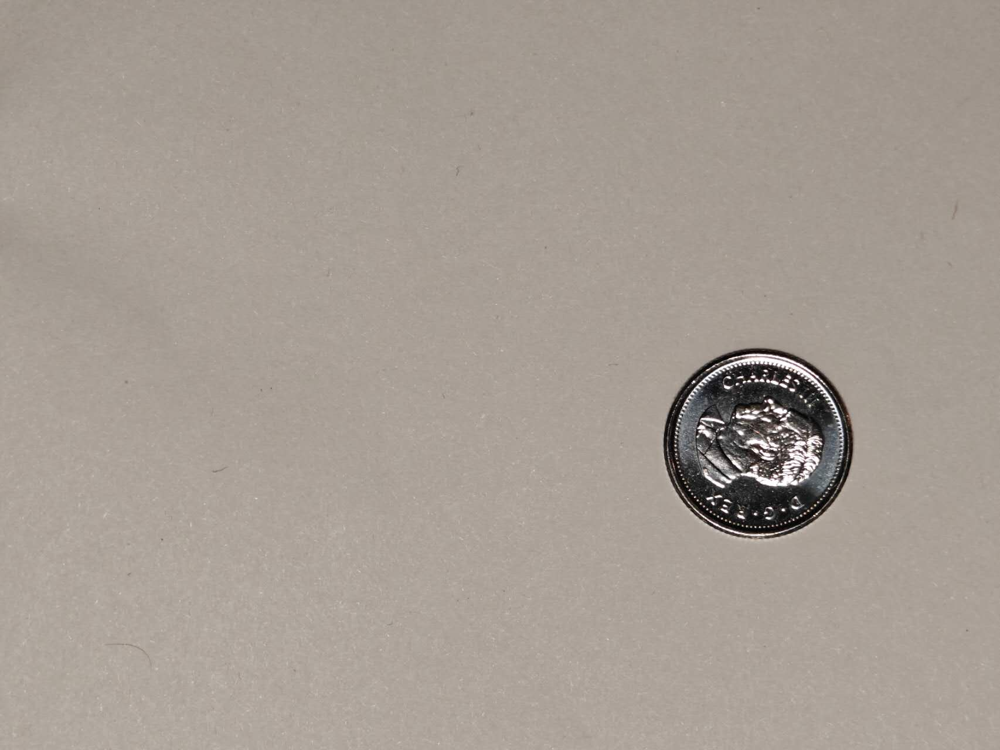
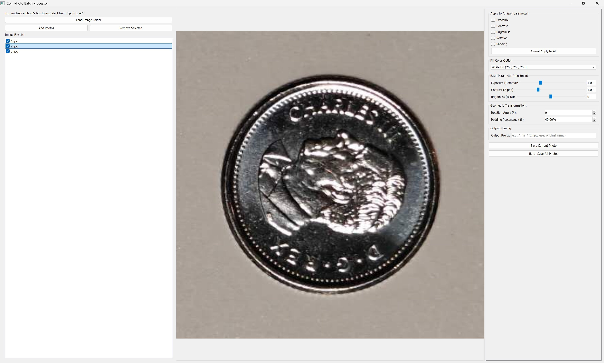
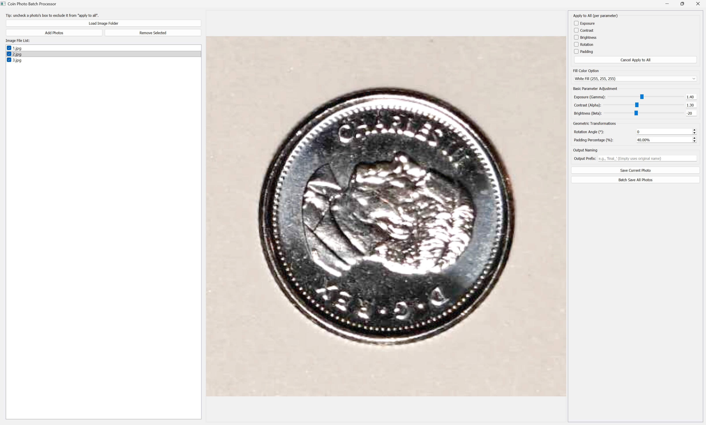
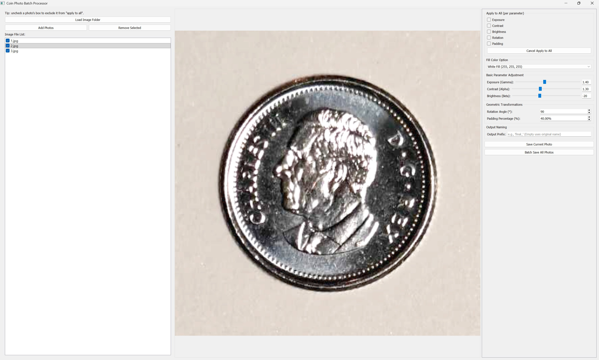
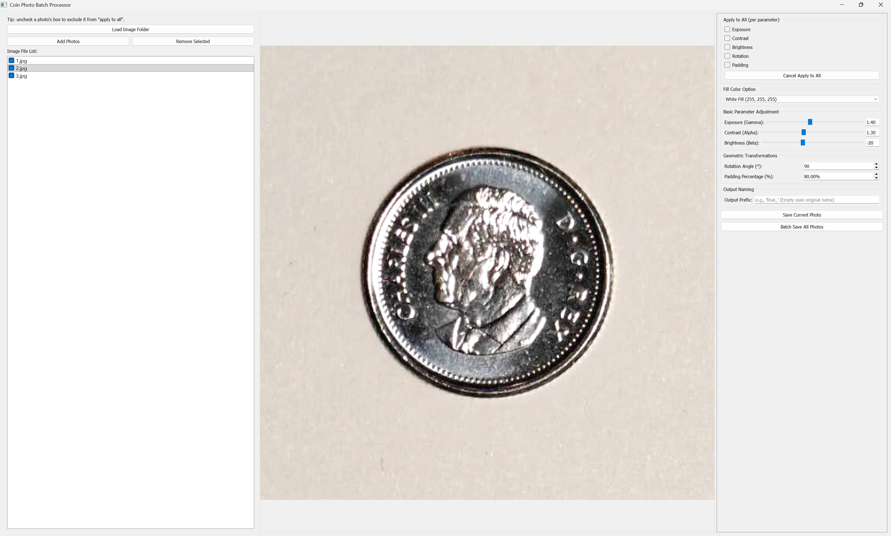

# Coin Photo Batch Processor

A desktop tool for batch-editing coin photos: it detects the coin in each image, lets you tweak exposure/contrast/brightness and rotation, then crops every photo to a clean, padded square around the coin — ready for a catalog, listing, or archive.

This tool was initially developed by [Sunhao Zhang](https://amne.ubc.ca/profile/sunhao-zhang/) to process coin photographs taken for the [Experiencing Antiquity](https://experiencingantiquity.omeka.net/) project at the University of British Columbia, Canada. Its aim is to automate the image-processing workflow and thereby accelerate data publication, not for this project alone but also for future museum cataloguing and excavation publications.

Built with **PyQt5** for the interface and **OpenCV** for image processing.

## Features

- **Auto coin detection** — adaptive thresholding + contour detection finds the coin and centers the crop on it automatically.
- **Per-photo or batch editing** — adjust gamma, contrast, brightness, rotation, and padding for a single photo, or broadcast any of those parameters across the whole set.
- **Independent "apply to all" per parameter** — e.g. sync rotation across every photo while keeping exposure adjusted individually per photo.
- **Per-photo exclusion** — uncheck a photo in the file list to opt it out of apply-to-all entirely (it won't send or receive broadcasts).
- **Cancel Apply to All** — turn off every apply-to-all toggle in one click without touching values already set.
- **Configurable fill color** for the padding/rotation border: white, black, or a distance-weighted average of the background.
- **Keyboard shortcuts**: `[` / `]` to nudge rotation, `Page Up` / `Page Down` to move between photos.
- **Batch export** with an optional filename prefix.

## Requirements

- Python 3.8+
- [PyQt5](https://pypi.org/project/PyQt5/)
- [opencv-python](https://pypi.org/project/opencv-python/)
- [numpy](https://pypi.org/project/numpy/)

## Installation

```bash
pip install PyQt5 opencv-python numpy
```

Then run:

```bash
python coin_processor.py
```

## Platform support

This runs on **Windows, macOS, and Linux** — PyQt5, OpenCV, and NumPy all ship prebuilt wheels for all three. A few platform notes:

- **Linux**: PyQt5's wheel bundles its own Qt runtime, but some minimal distros are missing shared libraries Qt needs at the OS level (e.g. `libxcb`, `libgl1`). If the app fails to start with an error mentioning `xcb` or a missing `.so`, install your distro's Qt/X11 base packages (e.g. on Debian/Ubuntu: `sudo apt install libxcb-xinerama0 libgl1`).
- **macOS**: works out of the box on both Intel and Apple Silicon with a recent `pip`; no extra system packages needed.
- **Windows**: works out of the box.
- File extension matching is case-insensitive on all platforms (the loader matches both `.jpg` and `.JPG`, etc.), so folders of photos from any OS or camera will load consistently.

## Usage

1. **Load Image Folder** to bulk-load all supported images from a folder (non-recursive), or **Add Photos** to pick individual files.
2. Select a photo in the list to edit it. Adjust Exposure, Contrast, Brightness, Rotation, and Padding with the sliders/spinboxes on the right.
3. To sync a parameter across photos, check that parameter's box under **Apply to All**. Uncheck a specific photo in the list to keep it independent of any apply-to-all broadcasts.
4. Use **Cancel Apply to All** to stop all broadcasting at once.
5. **Save Current Photo** or **Batch Save All Photos** to export, with an optional filename prefix.

### Shortcuts

| Key         | Action                   |
| ----------- | ------------------------ |
| `[`         | Rotate current photo -5° |
| `]`         | Rotate current photo +5° |
| `Page Up`   | Previous photo           |
| `Page Down` | Next photo               |

## Demo

Original photo of a 5-cent Canadian coin. Royal Canadian Mint, 2023:



Auto-centered:



Basic Parameter (Exposure, Contrast, Brightness) tuned:



Rotated to make the portrait of King Charles III straight:



Padding percentage adjusted:



## Known limitations

- Coin detection relies on reasonable contrast between the coin and its background; very low-contrast or heavily cluttered backgrounds may need manual rotation/padding adjustment.
- Loading a folder replaces the current session's photo list (adding individual photos does not).

## Development note

This project was developed with heavy use of AI pair-programming ("vibe coding") — a large share of the implementation, refactors, and this README were written with the assistance of an LLM, with human review and direction throughout. If you spot a rough edge or an odd design choice, that's likely why — issues and PRs are welcome.

## License

This project is licensed under the MIT License — see the [LICENSE](LICENSE) file for details.

